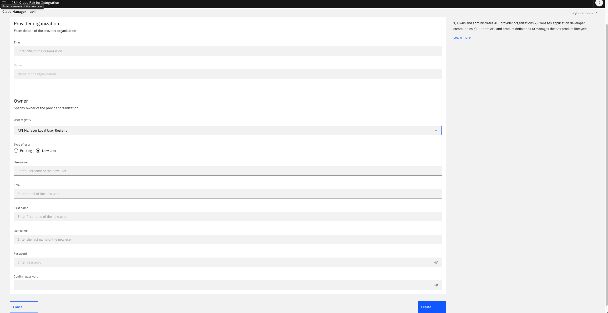

<h1>Creating an Organization on API Connect</h1>

For this lab it is recommended to use chrome or firefox. You may have to allow popups.

**Things that will be covered**

- Creating an organisation in API Connect Cloud Manager

<h3>Creating an organisation</h3>

Firstly head over to the Cloud Manager

Login using <strong>Cloud Pak User Registry</strong>

Head over to Manage organizations

Click the Add button and click Create Organization

Fill in the name, click on new user and fill out the information <strong>(SAVE THE PASSWORD)</strong>.

Once filled out click create.

