<h1>Creating and Registering a new Gateway on API Connect</h1>

**Things that will be covered**

- Creating a Gateway Cluster
- Creating an Availability Zone.
- Registering the Gateway.
- Creating a Catalog with the new Gateway.

<h3>Creating a Gateway</h3>

<p>First we need the Ingress subdomain.</p>

```
export INGRESS=`oc get ingresses.config/cluster -o jsonpath='{.spec.domain}'`
```

<p>Create a new Project.</p>

```
oc new project apic-gw
```

<p>Retrieve the auto created gateway ingress certificates.</p>

```
oc get secret apic-ingress-ca -n cp4i -o yaml > ingress-ca.yaml
```

<p><strong>IMPORTANT</strong> - Go into ingress-ca.yaml and change the namespace to <strong>apic-gw</strong> and apply the yaml file.</p>

```
oc apply -f ingress-ca.yaml
```

<p>Run the peering and Gateway certificate creation.</p>

```
oc apply -f common-issuer-and-gateway-certs.yaml
```

<p>Create the admin password secret.</p>

```
oc create secret generic gw-admin-secret --from-literal=password=admin
```

<p>Apply the Gateway Cluster.</p>

```
envsubst < gw.yaml | oc apply -f -
```

<p>Please Note it may take a couple of minutes to see the effect.</p>

<h3>Registering the service</h3>

<p>Firstly head over to Cloud Manager for API Connect. Click Configure topology.</p>

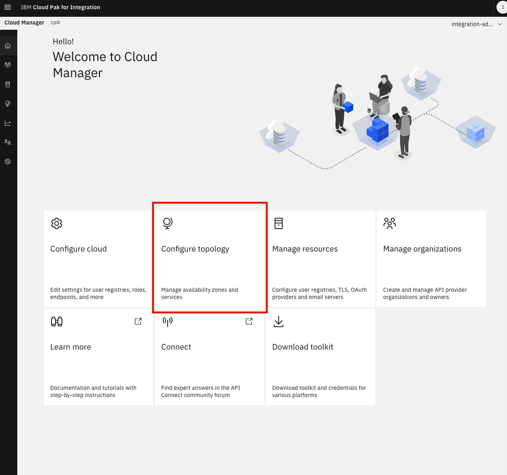

<p>Create availability zone</p>

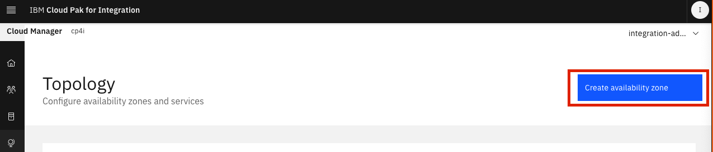

<p>Create the zone. (You can name the zone a name useful to you for example the city name where the gateway is located)</p>

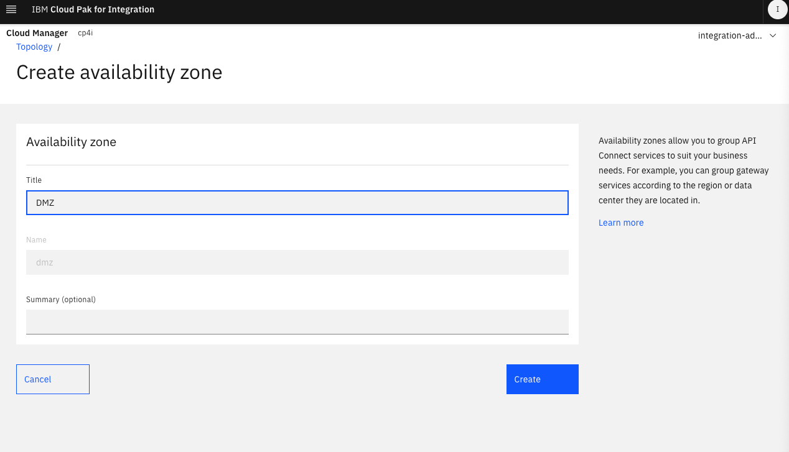

<p>Once create click register service</p>

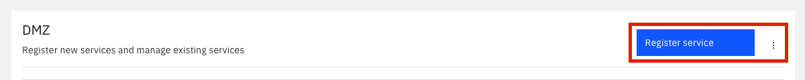

<p>Select DataPower API Gateway</p>

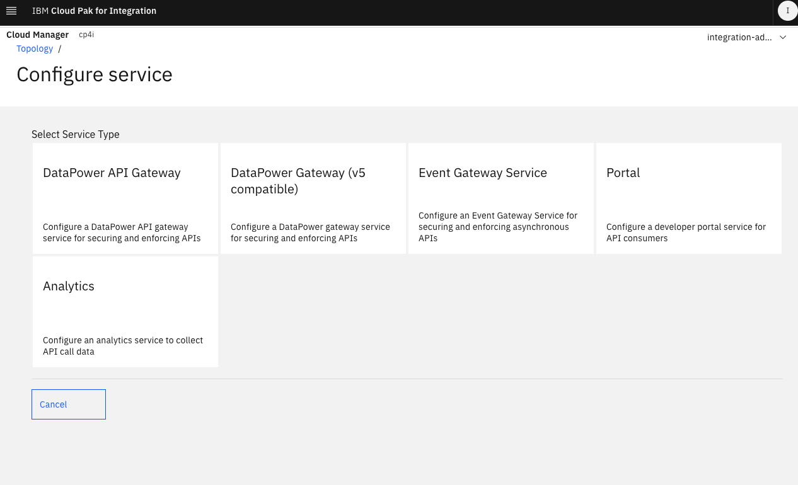

<p>Register the service, first you'll require the endpoints</p>

```
oc get routes
```

<p>You want to copy the endpoints in the table and fill out registration form and click save</p>

```
NAME                                 HOST/PORT                                                                                                      PATH   SERVICES                       PORT   TERMINATION   WILDCARD
apic-inter-c4b2b4b-gateway           <gateway-endpoint>                                                                                                    apic-inter-c4b2b4b-datapower   9443   passthrough   None
apic-inter-c4b2b4b-gateway-manager   <gateway-manager-endpoint>                                                                                            apic-inter-c4b2b4b-datapower   3000   passthrough   None
```

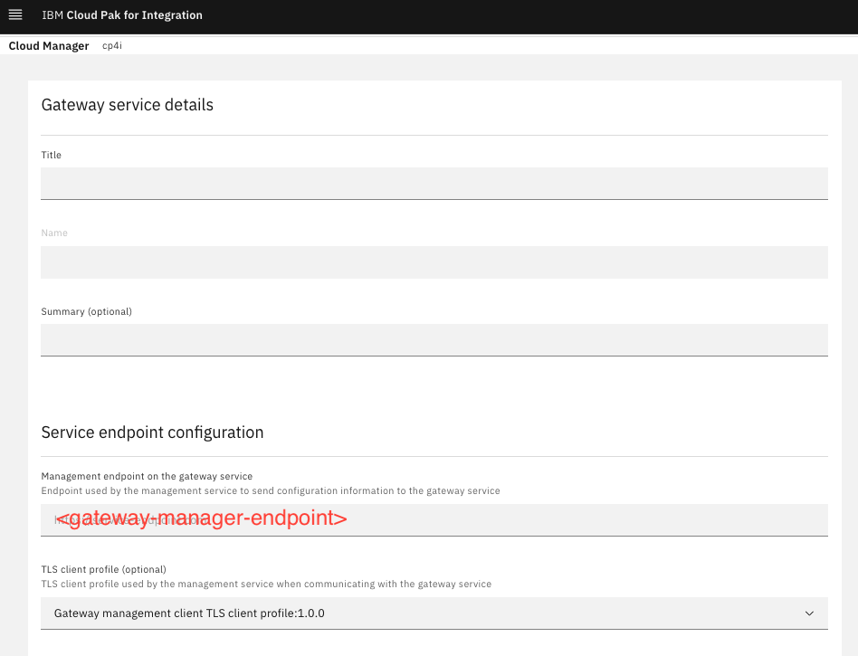

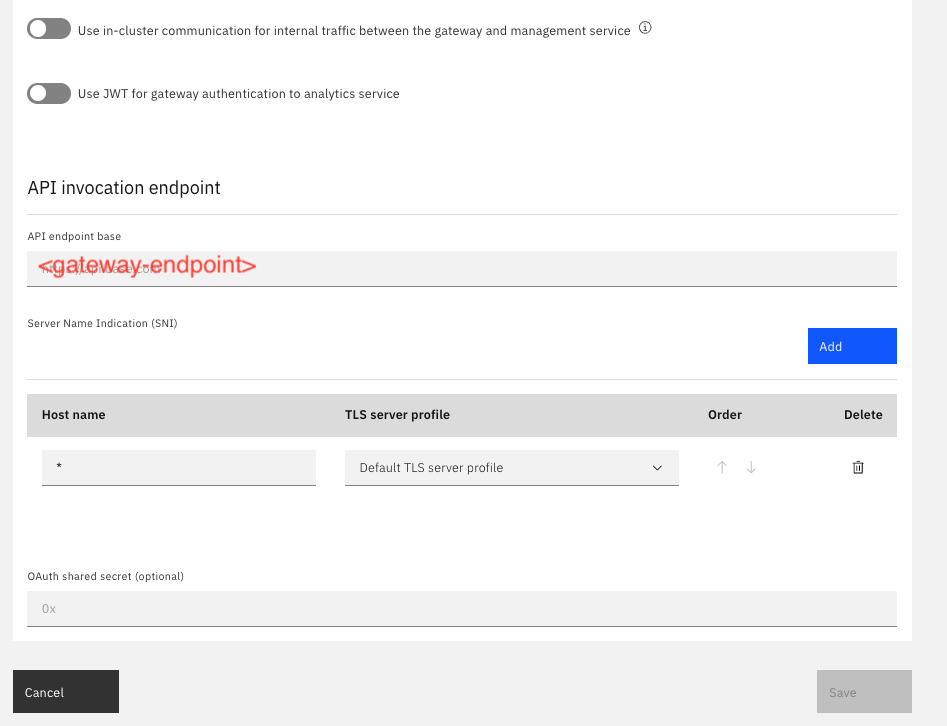

<p>If successful your Topology page should look like the image below</p>

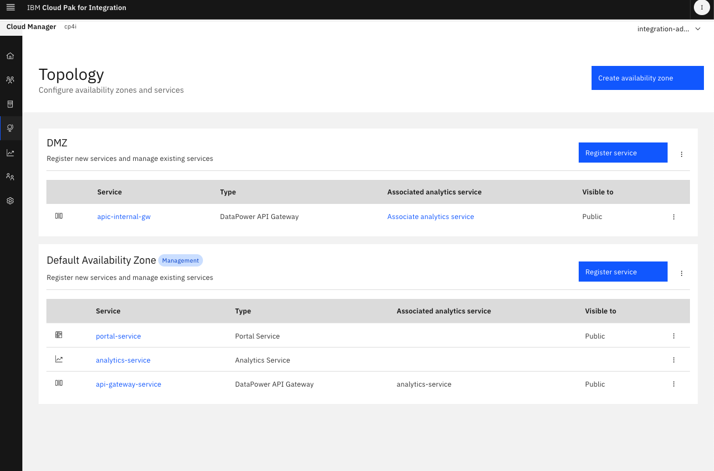

<h3>Creating a Catalog and assigning the new Gateway</h3>

<p>Head to API Manager, log into your organisation and go to Manage catalogs</p>

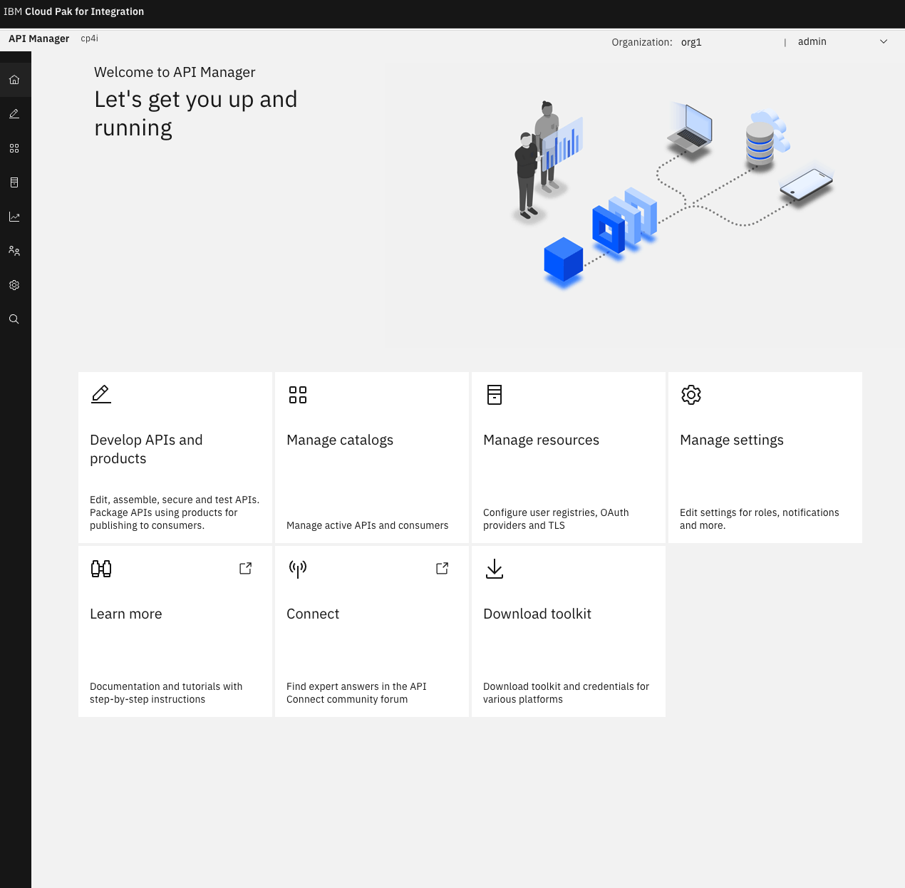

<p>Click on Add</p>

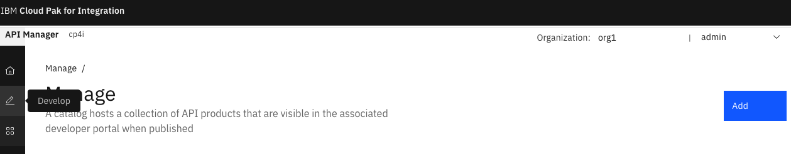

<p>Name the catalog and click create</p>

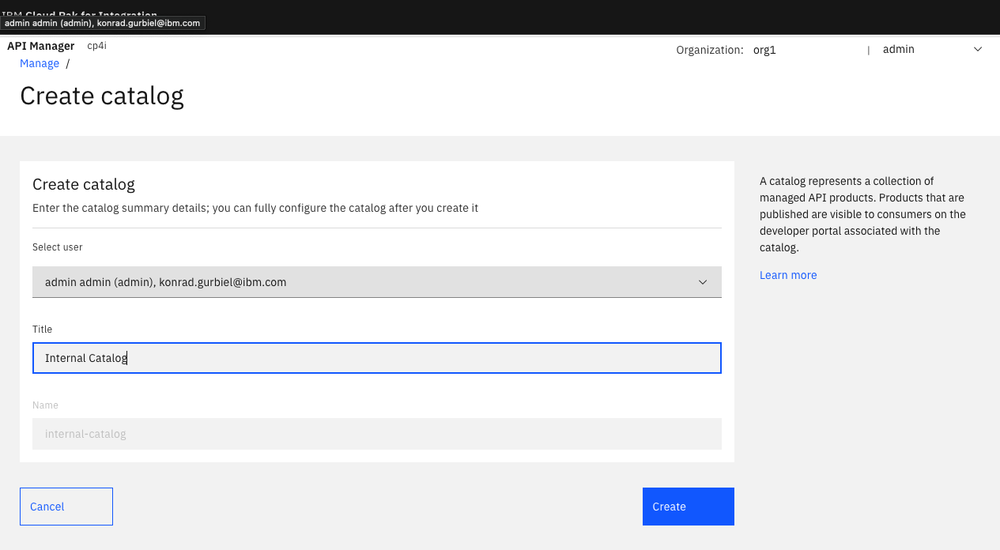

<p>Click the newly created Catalog</p>

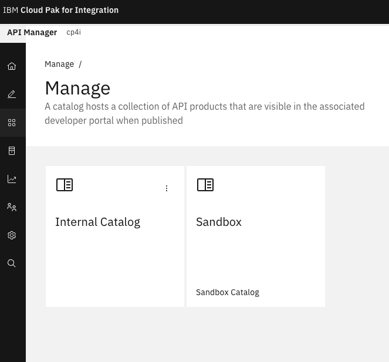

<p>Firstly click on Catalog settings, Gateway services and then Edit</p>

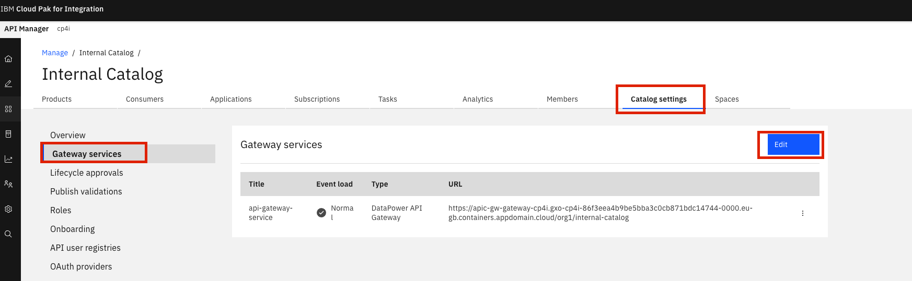

<p>Select the new Gateway service and deselect the default Gateway</p>

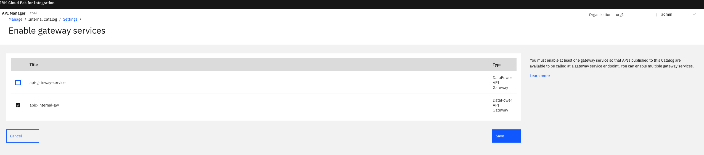

<h3>Congratulations</h3><p>You have just created a brand new Gateway and Registered it in API Connect and attached it to a catalog</p>
