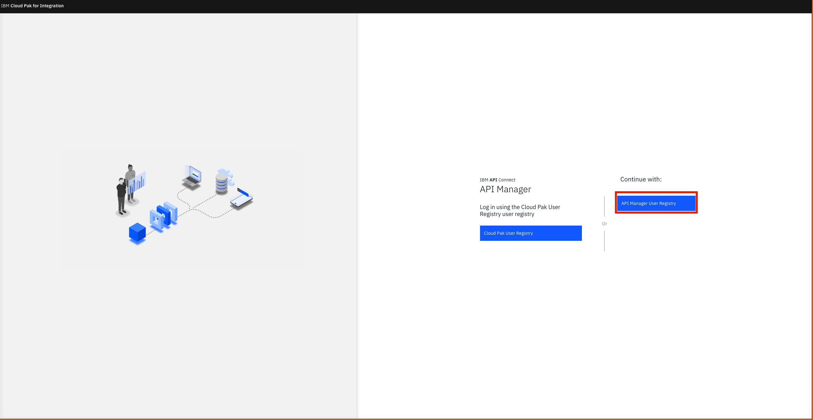
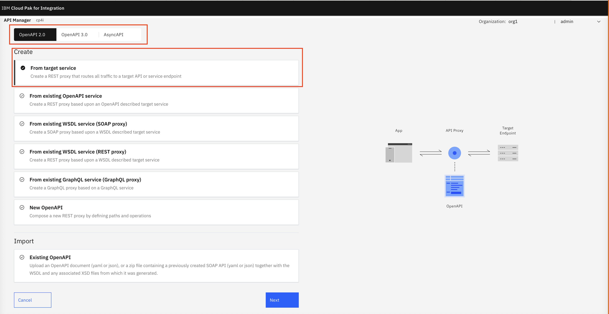
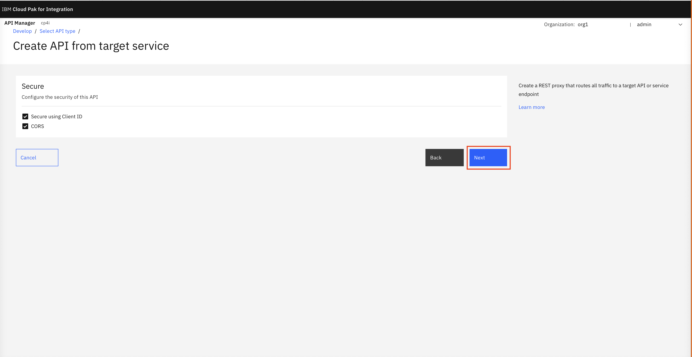
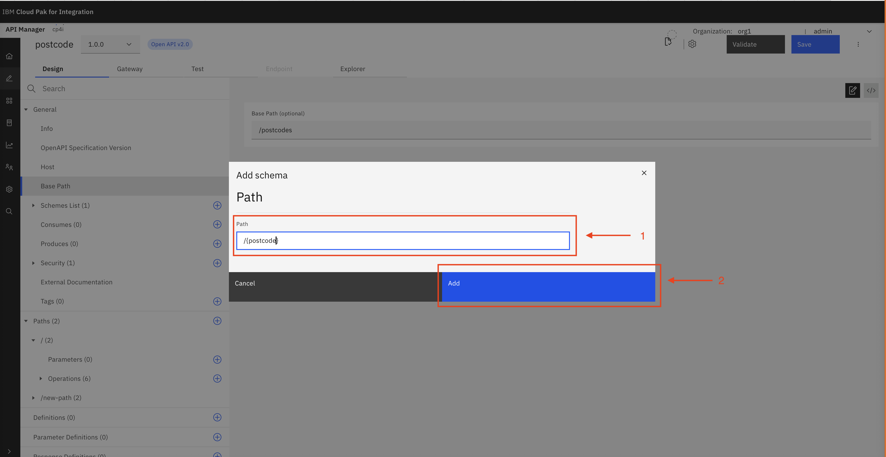
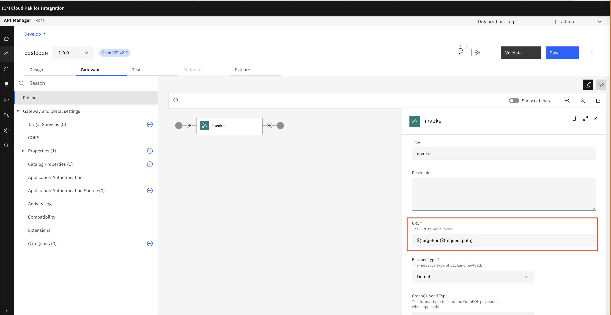

<h1>Creating an API using a target service</h1>

For this lab it is recommended to use chrome or firefox. You may have to allow popups.

**Things that will be covered**

- Creating an API using a Target Service.
- Securing our API using **Security Schemas**
- Creating a Product for our API.
- Testing our new API.

<h3>Creating API using Target Service</h3>

<p>Firstly Select API-Connect manager</p>


<p>Login using API Manager User Registry using the organisation credentials we created earlier</p>



<p>Once logged in click on develop API's and Products</p>


<p>Next click on Add and API</p>



<p>Click on From target service</p>


<p>Set the following options to: </p>

```
Title: Postcode
Base Path: /postcodes
Target Service URL: https://api.postcodes.io
```


<p>Keep the secure options as default</p>



<p>Next click Edit API</p>


<p>Click on hosts change the host to:</p>

```
${catalog.host}
```


<p>Go to base path and name the path to:</p>

```
{postcode}
```



<p>Next click the plus symbol to add a new operator to the path. Select the "Get" option.step</p>


<p>Next add a new parameter. To do this we will add a blank parameter and go back and fill it in later. When pressing submit it should look like the following.</p>


<p>Next go back and alter the parameter. Fill in the following options.</p>

```
Name: postcode
Required: tick
Located in: path
Type: string
```


<p>Select Gateway and then the invoke option </p>


<p>Once in the invoke section, change the URL to the following: </p>

```
$(target-url)$(request.path)
```



<p>Next go to the Test tab and select validate (a green tick should appear). Then select preferences.</p>


<p>Select the toggle "Auto-Publish"</p>


<p>Next go to the request header and select the target URL, it will be the one with the "{POSTCODE}" on the end. Then filll in the following: </p>

```
Key: postcode
Located In: Path
Value: SE17ND
```


<p>The following error may appear. Select open the server. Allow any pop ups and then close the window. Go back to the API manager and run the API again. </p>


<p>Once the API has been re-run the following output should appear</p>


