<h1>Creating an API using existing ACE Flow and Creating a Portal</h1>

**Agenda**

- Retrieving OpenAPI schema from Integration Runtime.
- Applying OpenAPI schema on API Connect.
- Editing the API to target the flow.
- Testing the flow.
- Publishing the API to a Catalog.
- Creating a Developer portal.

<h3>Retrieving OpenAPI schema from the Integration Runtime</h3>

<p>Firstly let's start by copying the OpenAPI Schema from the Integration Runtime. Replace the namespace and the pod name based on your environment</p>

<p>To retrieve the pod</p>

```
oc get pods | grep "greetings-ir"
```

```
kubectl cp <namespace>/<integration-runtime-pod>:ace-server/run/GreetingsREST/openapi.json openapi.json
```

<p>Example:</p>

```
kubectl cp cbtest/greetings-ir-678b68d595-jgd2l:ace-server/run/GreetingsREST/openapi.json openapi.json
```

<p>Next we need to get the route from the Integration runtime. If you have a IR running on HTTPS please take that route, if not take the HTTP route.</p>

```
oc get routes | grep "greetings-ir"
```

<h3>Creating an API from OpenAPI schema</h3>

<p>Firstly head over to Develop APIs and products</p>

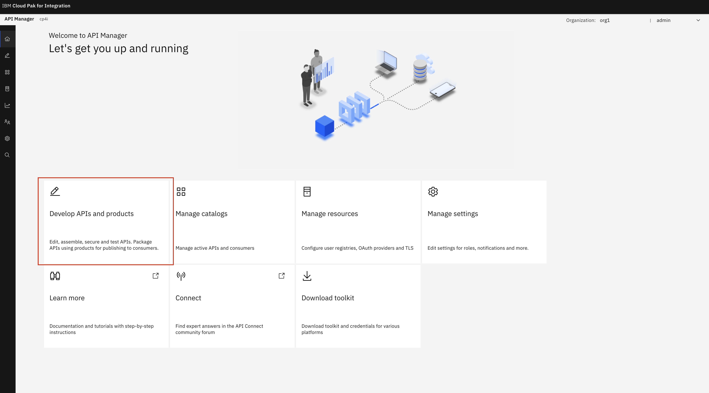

<p>Next click Add and then API</p>

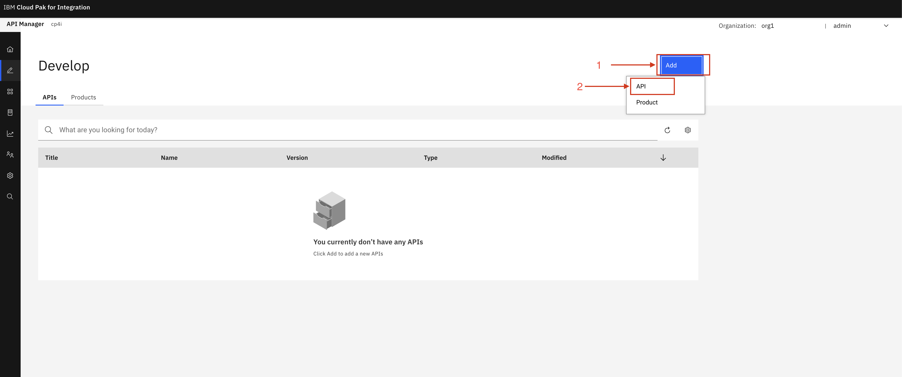

<p>Next click OpenAPI 3.0 and then select Existing OpenAPI</p>

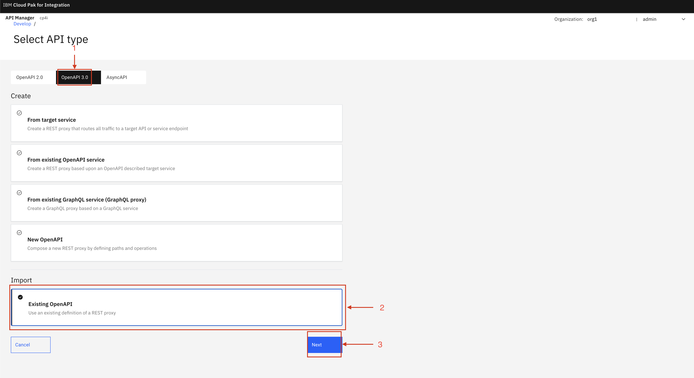

<p>Import the OpenAPI JSON file you retrieved from the Integration Runtime</p>

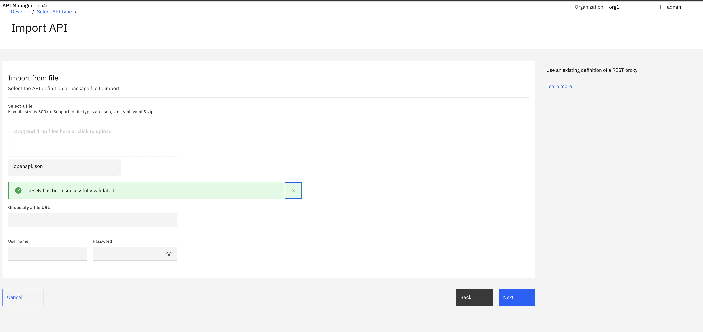

<p>Should get a green tick and click Edit API</p>

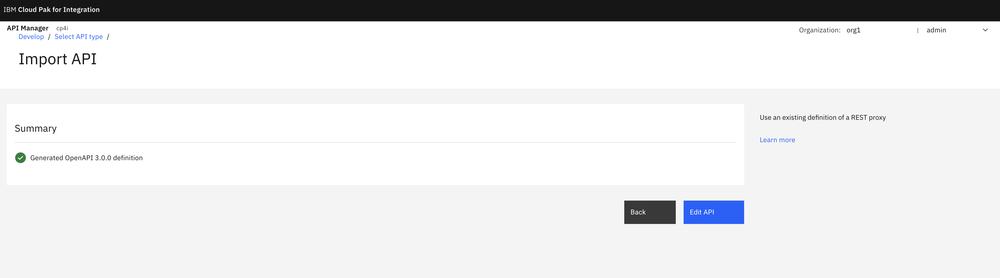

<p>Next hit Gateway, under properties click target-url and change the value to the route from our Integration Runtime as seen in the image</p>

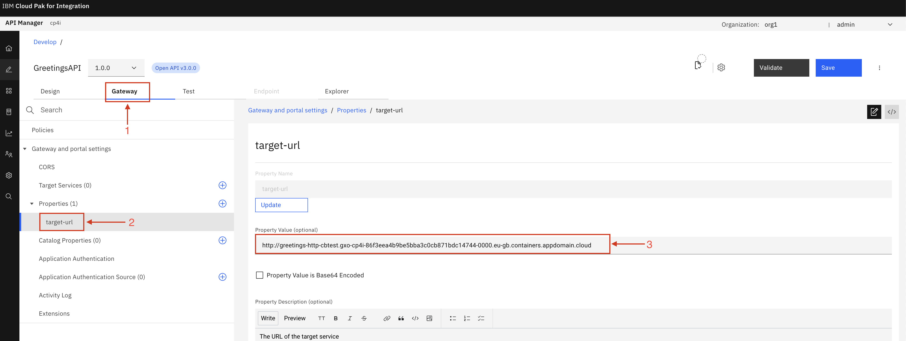

<p>We require to change the URL so we can add the query to the endpoint. Head over to Policies and then Invoke and copy the url</p>

```
$(target-url)$(request.path)?name=$(request.parameters.name)
```

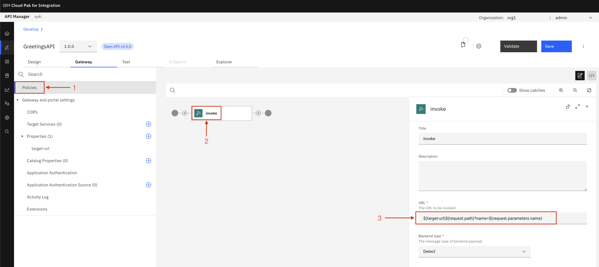

<p>Now we can hit Test and Target Configuration</p>

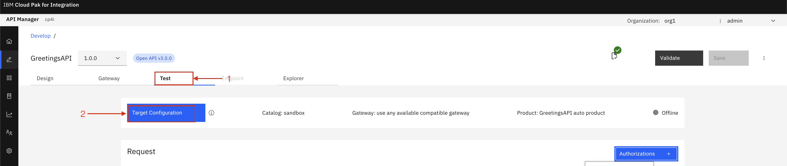

<p>Click Auto-publish</p>

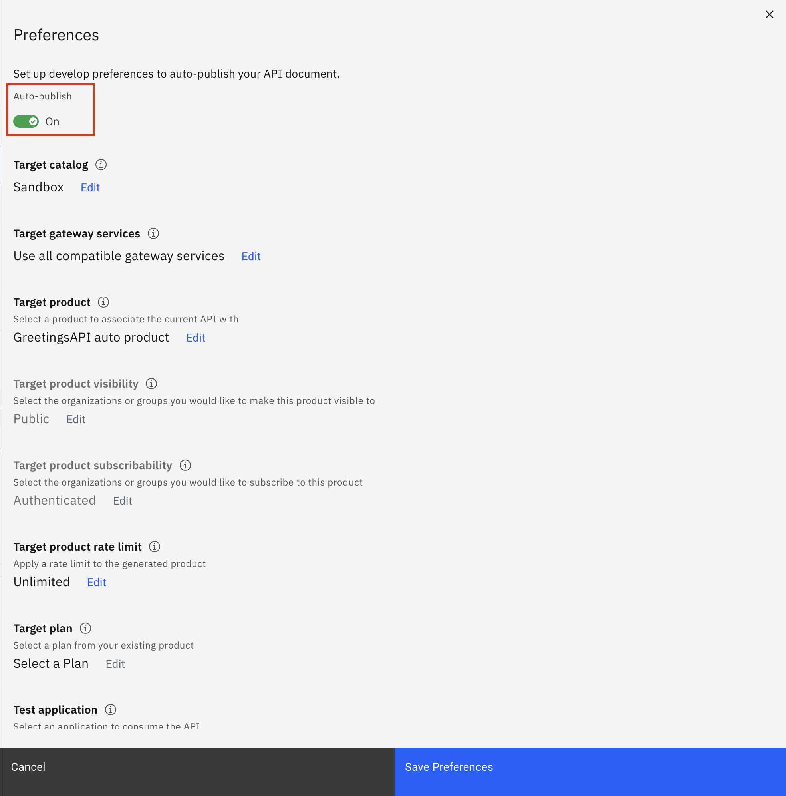

<p>Next select the GET endpoint and in parameters put the key of name and any value in the example "john" and then hit send.</p>

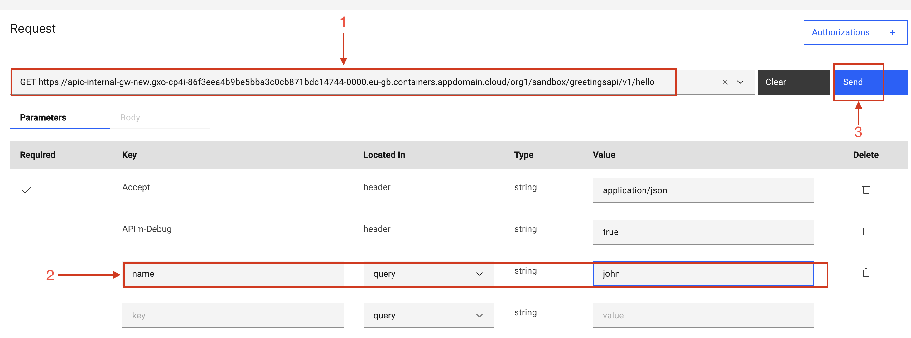

<p>You may get a CORS error if you do, click open the server and accept the certificate error.</p>

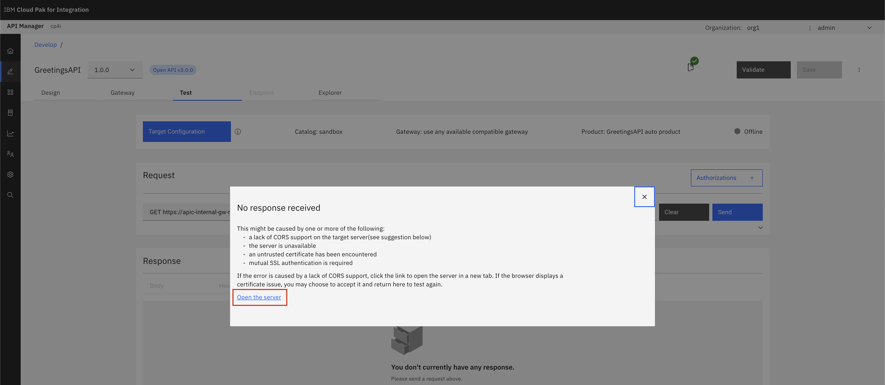

<p>If you have get a response with Hello, "name"</p>

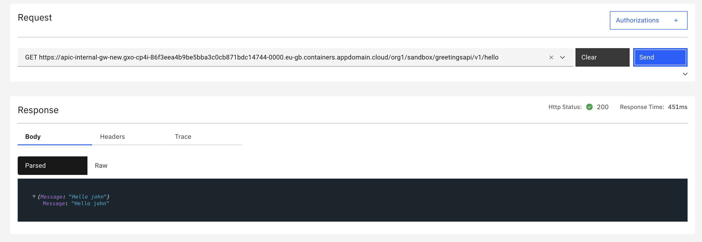

<p>Next we will publish the API</p>

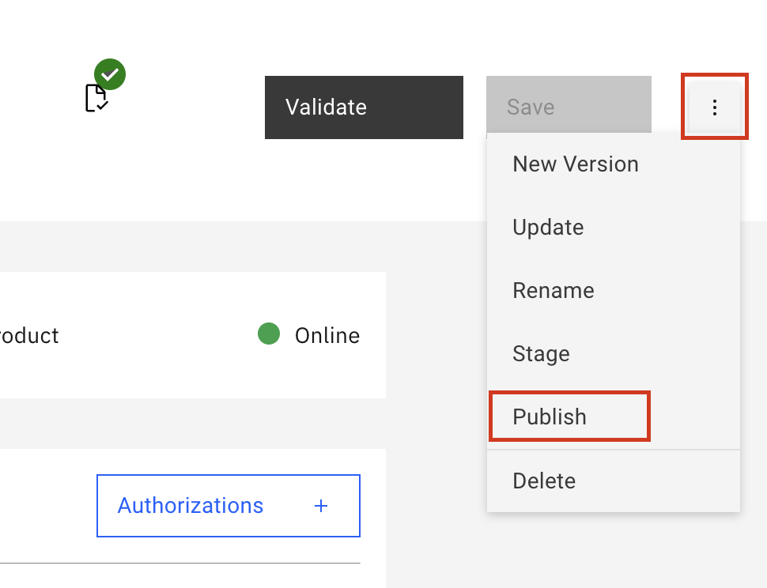

<p>We create a new Product for our API</p>

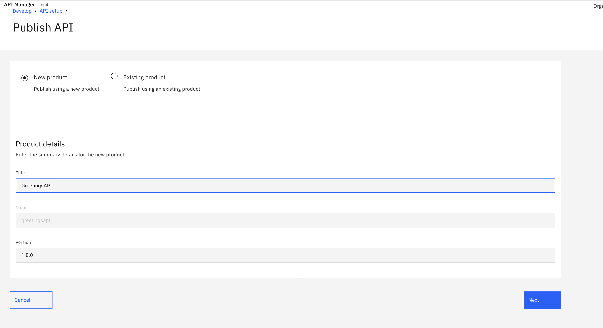

<p>Select the Catalog you'd like to publish your API to.</p>

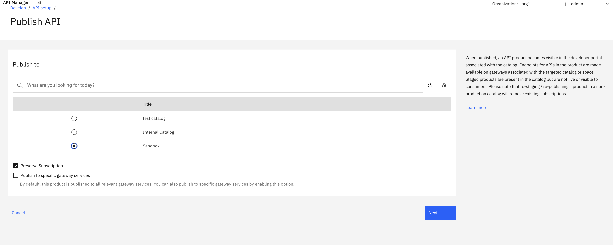

<p>We select the properties for our product</p>

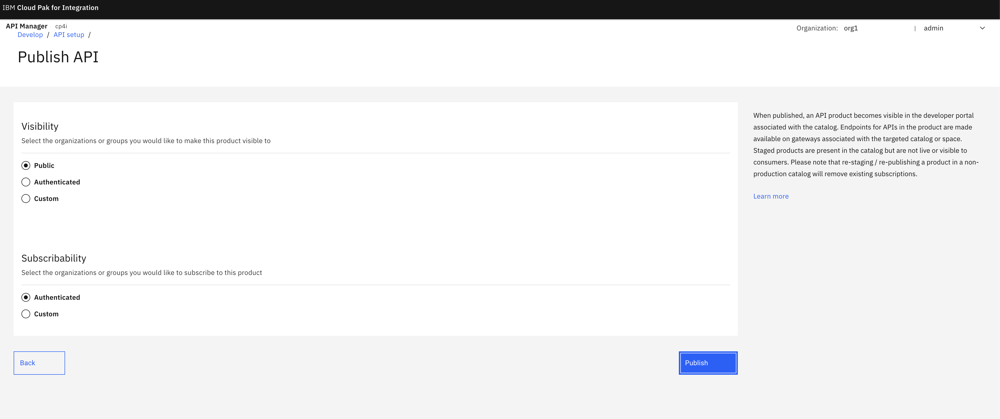

<h3>Creating a Developer Portal</h3>

<p>Next we go to the Catalog menu and click on the catalog you published your API to</p>

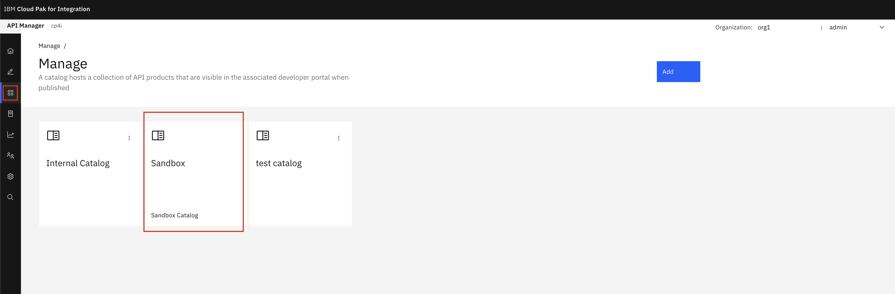

<p>We will create a Developer portal, firstly hit on the catalog settings, portal and then click create</p>

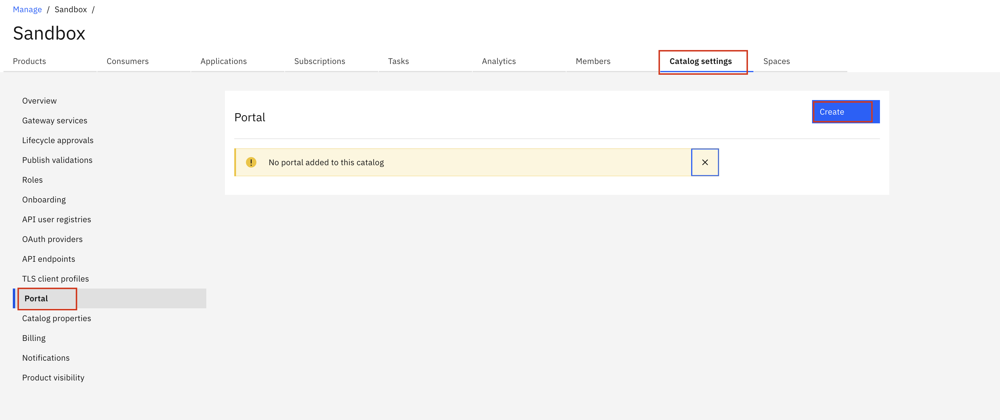

<p>Select the portal service and hit create. Note it will take a good couple minutes for the portal startup and be configured.</p>

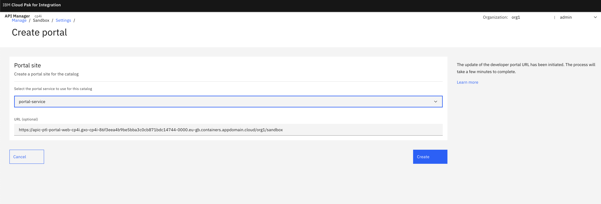
