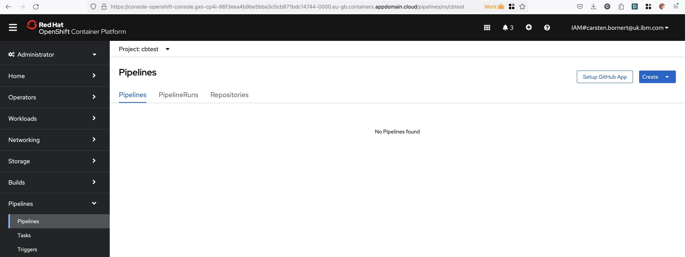
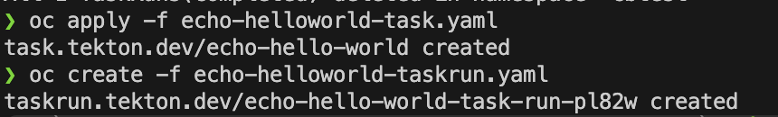
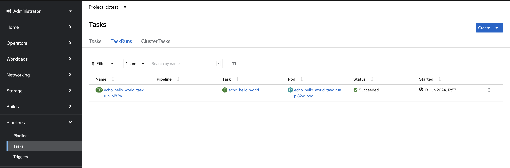
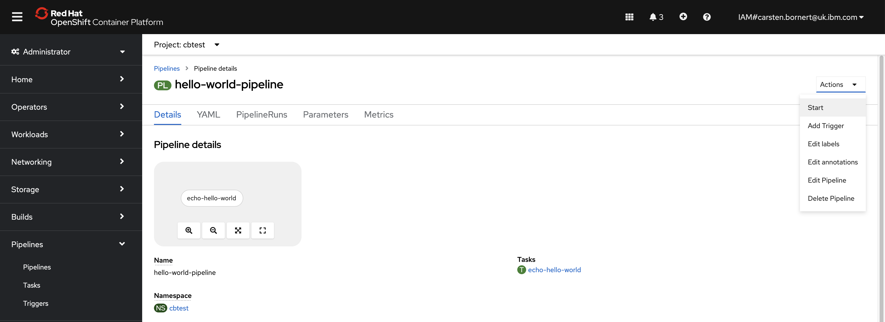
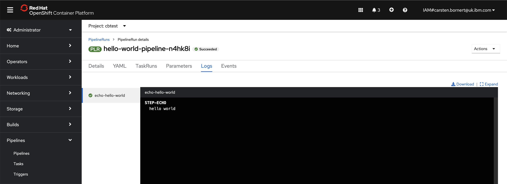

# Tekton Hello World

Follow the steps below to deploy a Tekton HelloWorld pipeline

## Prereqs

- Access to Openshift
- Openshift Pipelines Operator installed
- Tekton cli installed

## Instructions

1. Open the Openshift Console in your browser and log in
1. Navigate to the Pipelines section in the Administrator perspective.
1. At the top, change the project to your personal project (e.g. anthony). There should be no pipelines or tasks yet. 

1. Leave the browser window open in the background and log in to Openshift on the command line
1. Run the following command to create a tekton **Task** called echo-hello-world: `oc apply -f echo-helloworld-task.yaml`
1. Run the following command to create a tekton **TaskRun**: `oc create -f echo-helloworld-taskrun.yaml` 

1. Run the following tekton command to show the logs: `tkn tr logs`. This should display and `[echo] hello world` output
1. The TaskRun should also be visible in the browser . We now know that the task works fine on its own.
1. Next, create the pipeline that uses this task. Issue the following command to create it from the yaml definition: `oc apply -f helloworld-pipeline.yaml`
1. Locate the pipeline in the browser and use Actions menu to start the pipeline (create a PipelineRun)  
1. The display will automatically shift the PipelineRun. Review the logs to see the output (which is the same as from the TaskRun earlier).
1. You have successfully created your first Tekton pipeline. 

## Bonus
- Create a yaml version of a pipelinerun and use the cli to kick off the pipeline. You can use the [template-pipelinerun.yaml](./template-pipelinerun.yaml) file as a starting point.
