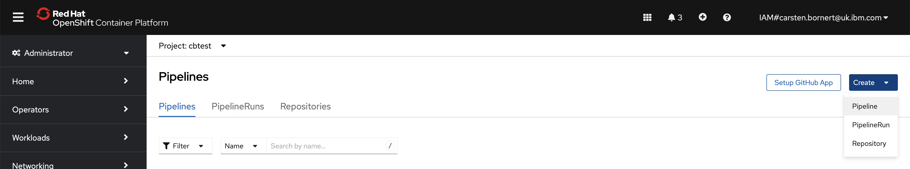
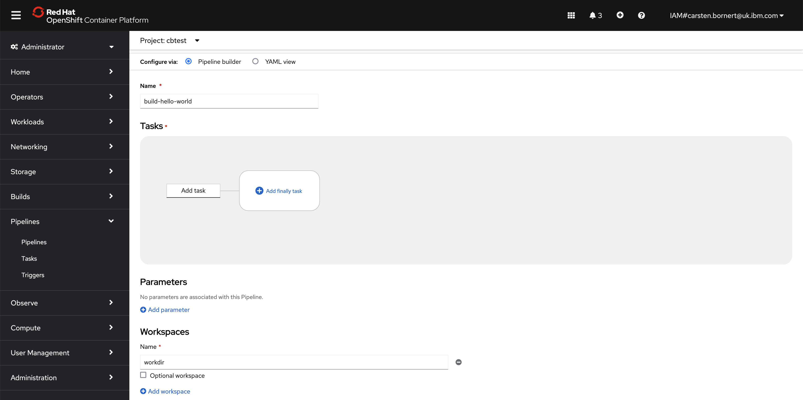
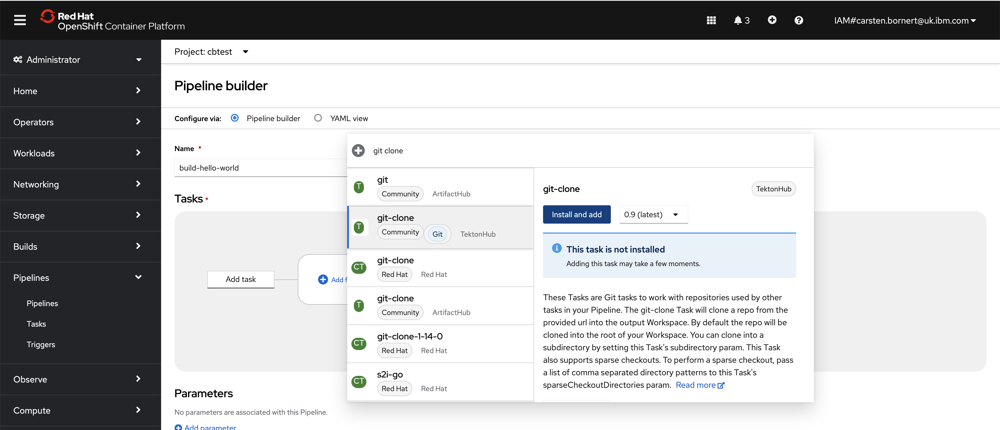
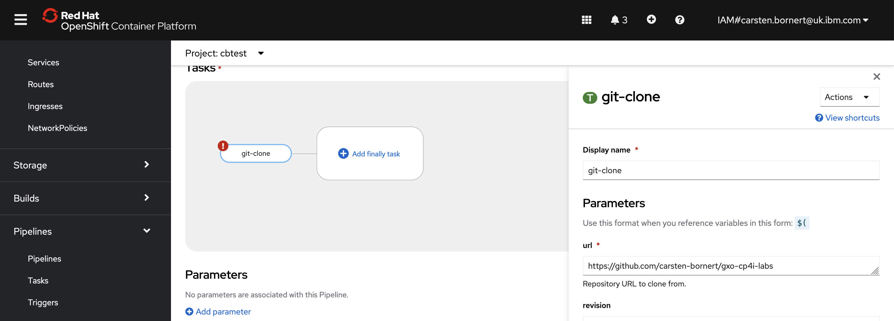
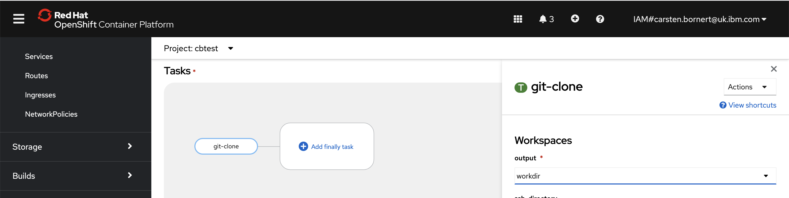
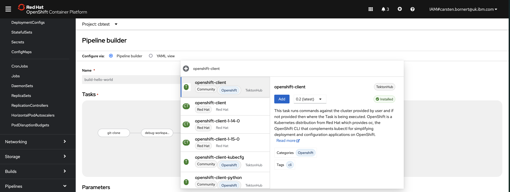
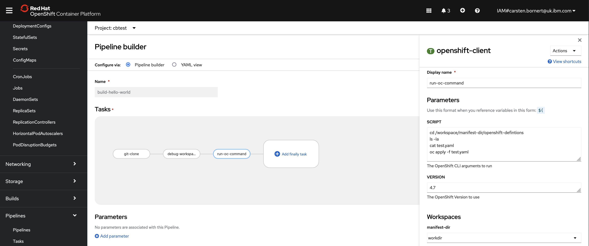

# Objective
The objective of this lab is to use the pipeline editor to create a new pipeline with multiple tasks

# Lab
1. Use the Openshift Console (web ui) and navigate to the Pipelines section
1. Use the blue button on the right to create a new pipeline 
1. Change the name of the pipeline to be `build-hello-world`
1. Use the `Add workspace` button at the bottom of the form to add a workspace to the pipeline and name it `workdir` 
1. Click on `Add Task` to search for `git clone`.
1. Select `git-clone` from the list and install it with the blue `install and add` button on the right 
1. The task will be highlighted in error as missing parameters. Select it to configure 
    - the repository to be cloned as `https://github.com/carsten-bornert/gxo-cp4i-labs` 
    - the workspace by selecting `workdir` from the dropdown menu 
1. On the command line, import the debug task into Openshift using the following command `oc apply debug-workspace-example-task.yaml`
1. Return to the pipeline builder in the browser. Hover of the graphical representation of the pipeline, right next to the `git-clone` task and click on the blue plus symbol that appears.
1. Click on `Add Task` and search for `debug` to find and add the newly imported `debug-workspace-example` task; then add it [add debug task](./images/add-debug-task.png)
    - Apart from providing some examples of bash scripts, the task also creates the yaml defintion for a ConfigMap
1. Add another task to providing the Openshift cli, which we can use to deploy/apply the ConfigMap yaml 
1. Configure the openshift-client task whith the following fields:
    - Display name: `run-oc-command`
    - SCRIPT (you can expand the box to have more space): **see screenshot for commands**
    - manifest-dir (dropdown): `workdir`
    
1. Save the pipeline with the `Save` button at the bottom of the screen
1. Start the pipeline from thet `Actions` menu on the top right

# Resources
- debug-workspace-example task [yaml definition](debug-workspace-example-task.yaml)
- pipeline [yaml definition](./solution/pipeline.yaml), in case you want to import it rather than construct it in the Pipeline Builder
