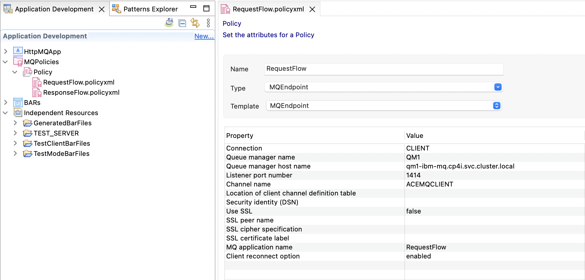

# Objective
Deploy a flow that communicates with MQ (with configurations)

# Instructions
- Create a new queue manager with the supplied MQSC defintions in the [defintions.mqsc](./defintions.mqsc) file. Also, make sure to set the following in the CR:
    - spec.template.pod.comtainers[].name: `qmgr`
    - spec.template.pod.containers[].env[]
        - name: `MQSNOAUT`
        - value: `'yes'`
- Create an MQ Policy Project to configure the connection details that will be used by the ACE flow 
    - You can import the MQConnectionPolicies.zip but will need to change the hostname in the policies to match your qmgr service name
- Export the policy project as a Project Interchange zip
- Create a AppConnect Configuration with the base64 encoded policy project zip file as contents
    - One easy way to create this is in the AppConnect Operator. There you can just select the configuration type and paste the base64 string.
    - Take note of the name of the Configuration you created.
- Create the AppConnect Integration Runtime
    - Make sure the CR references the Configuration that you created in the previous step
    - You can import the HttpMQApp sample application from the [HttpMQApp-project-interchange.zip](./HttpMQApp-project-interchange.zip) file
    - Make sure the MQ Output and Input nodes reference the MQ connection policies correctly
    - Create a Dockerfile and bake in the bar file; then push the new image to the Openshift internal registry and reference that image in the CR
- Test the deployed flow with the `/BackendService` uri in the browser (**capital letters B and S are important**)

# Resources
- Queue and channel mqsc [defintions.mqsc](./defintions.mqsc)
- Sample MQ Connection Policies in a project interchange [file](./MQConnectionPolicies.zip)
- Sample HttpMQApp ACE application in project interchange [file](./HttpMQApp-project-interchange.zip)
- Creating a Policy Project configuration object [documentation](https://ibm.biz/aceconfig)
- MQSNOAUT [documentation](https://www.ibm.com/docs/en/ibm-mq/9.2?topic=variables-environment-descriptions#q082720___MQSNOAUT__title__1)

# Bonus
- Add a server.conf.yaml to define a default policy instead of configuring the MQ Policy on every MQInput and MQOutput node