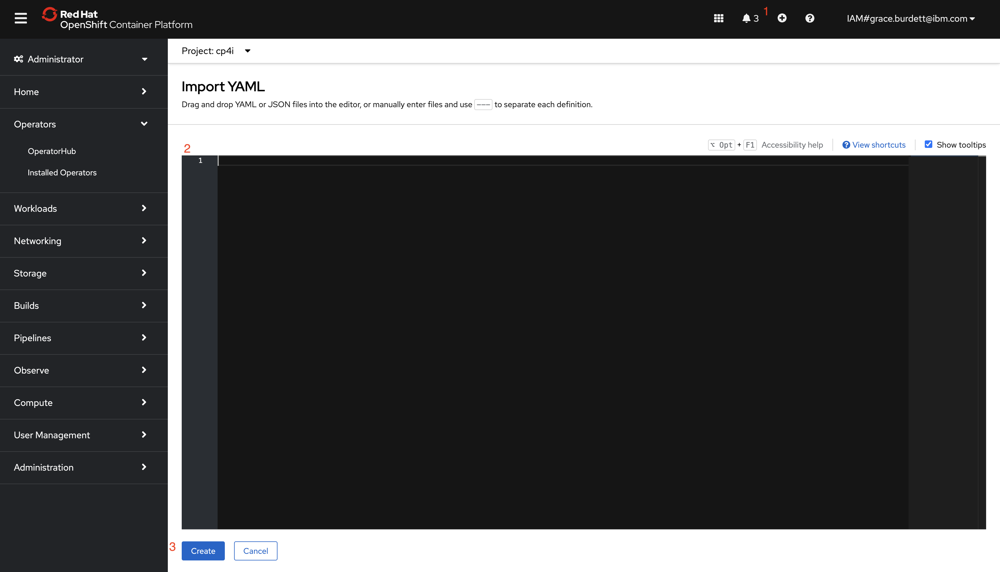

### Lab 2: Creating a Route and Connecting to MQExplorer and RFHUtil

##### Pre-Requisites:

In order to connect to RFHUtil and MQ Explorer and series of certificates will need to be generated first.

##### Section 1: Generating the Certificates

To generate the certificates follow the following commands:

1. For the purpose of this lab we have already pre-generated certificates, which you can view in the `certs-dir-cp4i` directory.

2. Download the zip file and store it somewhere easy to access.

##### Section 2: Adding the certificates to OpenShift

As we have pre-generated our certificates, they have already been added to our Openshift NameSpace. If we had not already pre-generated our certificates we would follow the following steps.

Now that we have generated the certificates we need to add them to our container. Before doing this it is a good idea to move the following Certificates into a folder of their own. This is because these are the three specific Certificates that need to be added to the container. These are:

- [NAME OF CERTIFICATE]-ca.crt
- [NAME OF CERTIFICATE]-server.crt
- [NAME OF CERTIFICATE]-server.key

1. The first thing you will want to do it to `cd` through your terminal into the directory that it is holding your Certificates.
2. You will then want to `oc` into your OpenShift environment. You can do this by going to the OpenShift Cluster and selecting Your profile and then `copy login command`.

3. Copy the command and paste into your terminal.

4. Then paste the following command into terminal:

`oc create secret tls [NAME OF SECRET]-tls --cert=[NAME OF CERTIFICATE]-server.crt --key=[NAME OF CERTIFICATE].key`

5. You can check that this secret has been created by running the following command.

` oc get secret [NAME OF SECRET]-tls`

6. You then want to add another secret, by running the following command:

` oc create secret generic gxo-ca-cert --from-file=gxo-ca.crt`

7. Again you check that the secret has been created by applying the following command:

`oc get secret gxo-ca-cert`

8. We then want to check that both the certificate and the key were created. YOu can do this by running the following command:

` oc describe secret [NAME OF SECRET]-tls`

If you want to see the value of the certificate and the key you can run the following command:

`oc get secret [NAME OF SECRET]-tls -o yaml`

To view our other certificate run the following command:

`oc get secret gxo-ca-cert -o yaml  `

##### Section 3: Creating a Route

In order to connect RFHUtil and MQ Explorer to our OpenShift Cluster we need to create a route. The following steps will explain how to do this.

1. Go to the following [YAML document](../QueueManagerYAML/route.yaml). The document will display a current example of what the route should look like.

2. Copy the YAML file and add it as a config map into OpenShift. To do this click the plus button at the top of the OpenShift cluster. (Make sure you are in the correct namespace)

3. Then select create.



##### Section 4: Connecting to RFHUtil:

1. To connect to RFHUtil the first thing to do is to ensure that your certificates are located on a folder on your desktop or stored somewhere that is easy to access. If you are working on a VM make sure that you copy the certificates over.

2. To connect to RFHUtil the following environment variables will need to be set. This will enable you to be able to connect to RFHUtil.

The following environment variables should be set:

```
  SET ROUTE=[ROUTE OF QUEUE MANAGER]
  SET MQSERVER=[NAME OF QUEUE].SVRCONN/TCP/%ROUTE%(443)
  SET MQCERTLABL=aceclient
```

To access the Route go to your OpenShift console.

3. Once you have set each of these environment variables. Move to your command prompt. Find your directory that stores your certificates and run the following environment variables.

4. Open RFHUtil. For the Queue Manager it should automatically recognise the Name to connect to, by clicking on the dropdown.

5. For Queue Name enter the name of Queue that created earlier. AS defined in the MQSC Commands.

6. We will then need to configure some Connection parameters. We cna do this by selecting `Set ConnID`.

7. Enter the following Parameters:
   <b>UserId:</b> app
   <b>Password:</b> app
   <b>Certificate Store Location:</b> [path-to-directory]\Certs\ace-server
   <b>Select SSL</b>
   <b>SSL Cipher Algorithm: </b> ECDHE_RSA_AES_256_CBC_SHA384

8. You can then test this is working by selecting the Read Queue button.
9. You should be able to see your queue running by accessing the pod that is running it from the OpenShift platform.
10. Once inside of the pod running the Queue, go to the terminal and run the following commands:

```
run mqsc
DISPLAY CHSTATUS([NAME OF QUEUE].SVRCONN)
```

##### Section 5: Connecting to MQ Explorer:

1. Right Click on queue managers and select `Add Remote Queue Manager...`

2. State the Name of the Queue Manager. Keep All of the other options as default.

3. Set the Host Name to the route of queue manager that we used for teh RFHUtil set up. Ensure that Port number reflects the one stated. And set the channel name (again you can refer back to the settings from the set up of RFHUtil)

4. Enable the SSL Key Repositories. For the Trusted certificate Store set it to the ca.jks file. For the Personal Certificate Store set it to the server.jks file.

5. Enable the SSL options. The SSL CipherSpec should be `TLS_AES_128_GCM_SHA256`

6. Select Finish.
